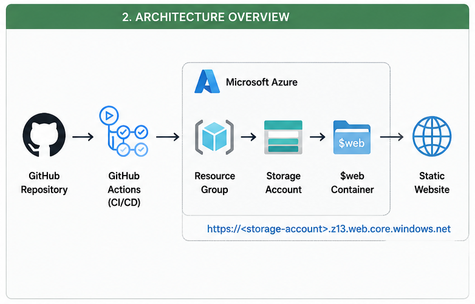

# ☁️ Host a Website on Azure Blob Storage
A hands-on Azure cloud project demonstrating how to host a static website using **Azure Blob Storage**, provision infrastructure with **Terraform**, and automatically deploy website changes using **GitHub Actions**.


## Architecture Diagram




## 🛠️ Technologies Used

* Microsoft Azure
* Azure Blob Storage
* Azure Storage Account
* Azure Static Website Hosting
* Terraform
* GitHub
* GitHub Actions
* Azure CLI
* HTML
* CSS
* JavaScript
* Microsoft Entra ID
* GitHub OIDC

## 📁 Project Structure

```text
host-website-on-azure-blob/
│
├── .github/
│   └── workflows/
│       ├── deploy.yml
│       └── destroy.yml
│
├── terraform/
│   ├── main.tf
│   ├── variables.tf
│   ├── outputs.tf
│   ├── providers.tf
│   └── terraform.tfvars.example
│
├── website/
│   ├── index.html
│   ├── style.css
│   └── script.js
│
├── .gitignore
├── README.md
└── LICENSE
```

## ⚙️ How It Works

### Step 1 — Developer pushes code

```text
git push origin main
```

### Step 2 — GitHub Actions starts

The deployment workflow automatically starts.

### Step 3 — Terraform creates infrastructure

Terraform creates:

```text
Resource Group
      │
      └── Storage Account
             │
             └── Static Website
```

### Step 4 — Website files are uploaded

GitHub Actions uploads:

```text
index.html
style.css
script.js
```

to the Azure Storage `$web` container.

### Step 5 — Website becomes accessible

Terraform returns the Azure static website endpoint.

## 🔐 Security

This project uses GitHub Actions OIDC authentication.

Instead of storing a permanent Azure client secret, GitHub Actions obtains a short-lived identity token and authenticates with Microsoft Entra ID.

Required GitHub repository secrets:

```text
AZURE_CLIENT_ID
AZURE_TENANT_ID
AZURE_SUBSCRIPTION_ID
STORAGE_ACCOUNT_NAME
```

Never commit credentials or Terraform state files to GitHub.


## 🧪 Local Terraform Deployment

```bash
terraform init
```
Validate the configuration:

```bash
terraform validate
```
Create a plan:

```bash
terraform plan
```
Deploy:

```bash
terraform apply
```

Get the website URL:

```bash
terraform output static_website_url
```

## 🔄 GitHub Actions Deployment

After configuring the GitHub repository secrets, push changes:

```bash
git add .
git commit -m "Deploy Azure Blob static website"
git push origin main
```

GitHub Actions will:

1. Authenticate with Azure.
2. Initialize Terraform.
3. Validate Terraform.
4. Create/update Azure infrastructure.
5. Upload website files.
6. Complete the deployment.

## 🗑️ Destroy Infrastructure

The repository contains a manual GitHub Actions destroy workflow.

Open:

```text
GitHub
→ Actions
→ git add .github/workflows/destroy.yaml
→ git commit -m "Add Terraform destroy workflow"
→ git push origin main
```
or 

```text
GitHub
→ Actions
→ git checkout -b destroy
→ git add .github/workflows/destroy.yaml
→ git commit -m "Add destroy workflow"
→ git push origin destroy
```


The workflow executes:

```bash
terraform destroy
```

This removes the Terraform-managed Azure resources.

## 🎯 Learning Objectives

After completing this project, you will understand:

* Azure Storage Accounts
* Azure Blob Storage
* Static website hosting
* `$web` containers
* Terraform Infrastructure as Code
* Azure authentication
* GitHub OIDC
* GitHub Actions
* CI/CD
* Azure CLI
* Cloud deployment automation
* Infrastructure destruction

